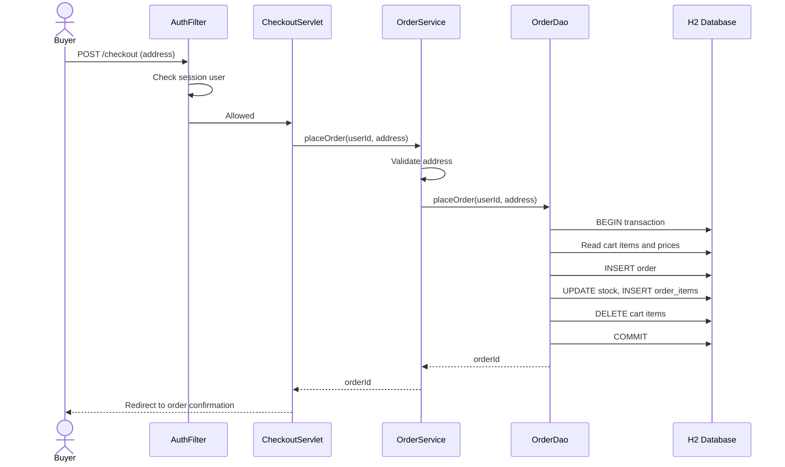

```mermaid
sequenceDiagram
    actor Buyer
    participant Filter as AuthFilter
    participant Servlet as CheckoutServlet
    participant Service as OrderService
    participant DAO as OrderDao
    participant DB as H2 Database
    Buyer->>Filter: POST /checkout (address)
    Filter->>Filter: Check session user
    Filter->>Servlet: Allowed
    Servlet->>Service: placeOrder(userId, address)
    Service->>Service: Validate address
    Service->>DAO: placeOrder(userId, address)
    DAO->>DB: BEGIN transaction
    DAO->>DB: Read cart items and prices
    DAO->>DB: INSERT order
    DAO->>DB: UPDATE stock, INSERT order_items
    DAO->>DB: DELETE cart items
    DAO->>DB: COMMIT
    DAO-->>Service: orderId
    Service-->>Servlet: orderId
    Servlet-->>Buyer: Redirect to order confirmation
```
